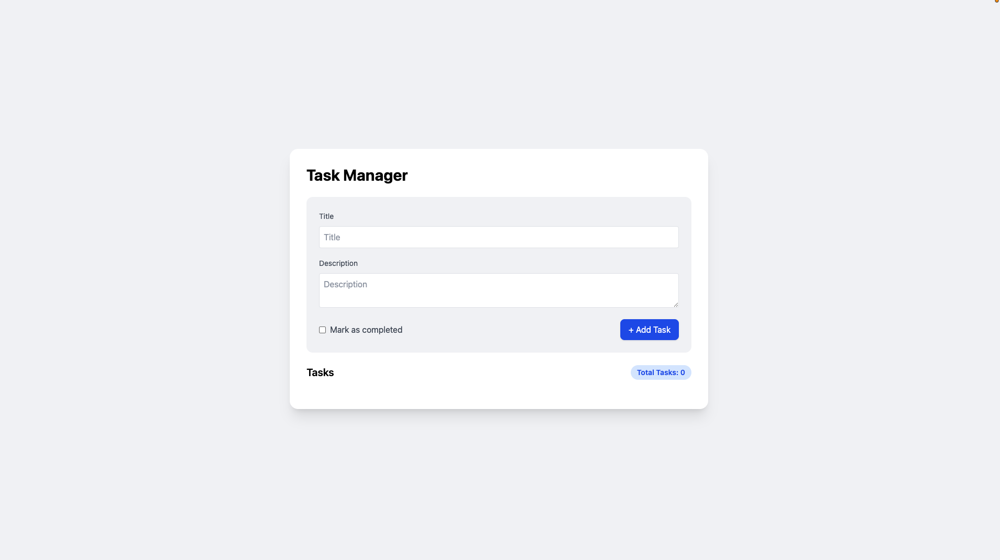
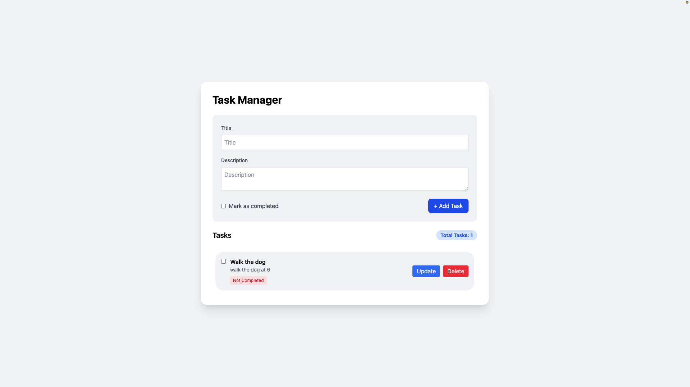
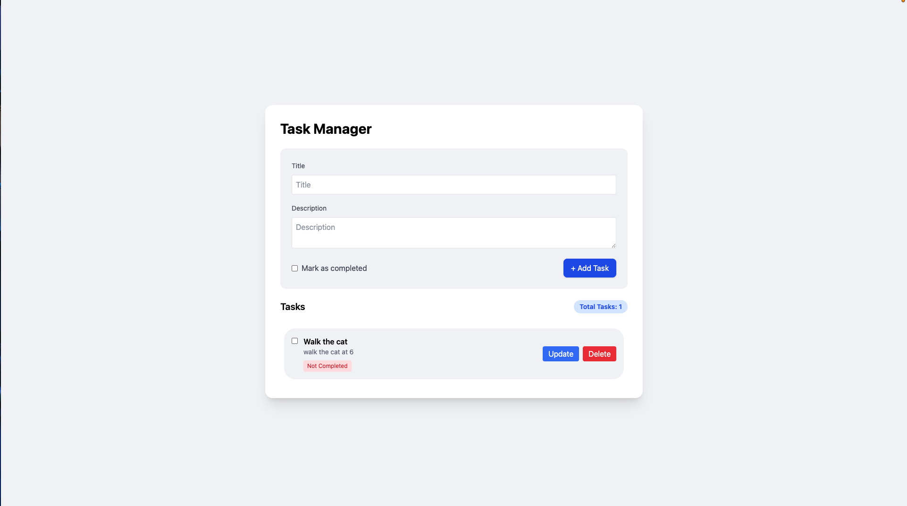
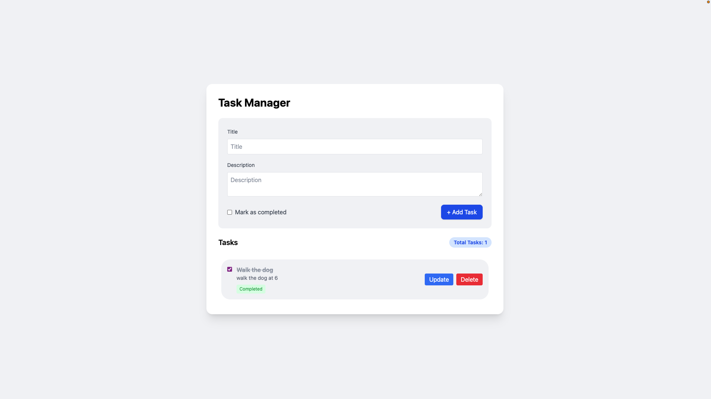

# Task Manager


A full-stack task management web application built with a vanilla JavaScript frontend, an Express.js REST API backend, and a persistent SQLite database — all orchestrated with Docker Compose.

**Authors:** Shaquille O'Neil · Chadi Faour

---

## Screenshots

### Main Screen


### Adding a Task


### Updating a Task


### Completing a Task


---

## Features

- **Create** tasks with a title, description, and optional completion status
- **Read** all tasks with a live task counter
- **Update** any task's title, description, or completion status
- **Delete** tasks individually
- **Toggle** completion directly via checkbox
- Visual status badges (green for completed, red for not completed)
- Data persists across container restarts via a Docker volume

---

## Tech Stack

| Layer     | Technology                          |
|-----------|-------------------------------------|
| Frontend  | HTML, Tailwind CSS (CDN), Vanilla JS |
| Backend   | Node.js 20, Express.js 5            |
| Database  | SQLite via `better-sqlite3`         |
| Server    | Nginx (Alpine) — serves static files |
| Dev Ops   | Docker & Docker Compose             |

---

## Project Structure

```
TrendsProject/
├── docker-compose.yml
├── frontend/
│   ├── Dockerfile          # Nginx Alpine serving static files
│   ├── index.html
│   └── app.js
└── backend/
    ├── Dockerfile          # Node.js 20
    ├── package.json
    └── index.js            # Express REST API + SQLite
```

---

## Getting Started

### Prerequisites

- [Docker Desktop](https://www.docker.com/products/docker-desktop/) (includes Docker Compose)

### Run the App

```bash
git clone <your-repo-url>
cd TrendsProject
docker compose up --build
```

Then open your browser:

| Service  | URL                     |
|----------|-------------------------|
| Frontend | http://localhost:8080   |
| Backend  | http://localhost:4000   |

To stop the containers:

```bash
docker compose down
```

> Task data is stored in a Docker named volume (`sqlite_data`) and persists between restarts. To wipe all data, run `docker compose down -v`.

---

## API Reference

Base URL: `http://localhost:4000`

| Method | Endpoint      | Description              | Request Body                                  |
|--------|---------------|--------------------------|-----------------------------------------------|
| GET    | `/tasks`      | Retrieve all tasks       | —                                             |
| POST   | `/tasks`      | Create a new task        | `{ title, description, completed? }`          |
| PUT    | `/tasks/:id`  | Update an existing task  | `{ title?, description?, completed? }`        |
| DELETE | `/tasks/:id`  | Delete a task            | —                                             |

### Example — Create a Task

```bash
curl -X POST http://localhost:4000/tasks \
  -H "Content-Type: application/json" \
  -d '{"title": "Buy groceries", "description": "Milk, eggs, bread", "completed": false}'
```

### Example Response

```json
{
  "id": 1,
  "title": "Buy groceries",
  "description": "Milk, eggs, bread",
  "completed": false
}
```

---

## Docker Compose Configuration

```yaml
services:
  backend:
    build: ./backend
    ports:
      - "4000:4000"
    volumes:
      - sqlite_data:/app/data

  frontend:
    build: ./frontend
    ports:
      - "8080:80"

volumes:
  sqlite_data:
```

The backend builds from `./backend` using a Node.js 20 base image. SQLite data is written to `/app/data` inside the container and backed by the `sqlite_data` named volume. The frontend builds from `./frontend` using an Nginx Alpine image that serves the static files on port 80, exposed externally on port 8080.

---

## Authors

- **Shaquille O'Neil**
- **Chadi Faour**
